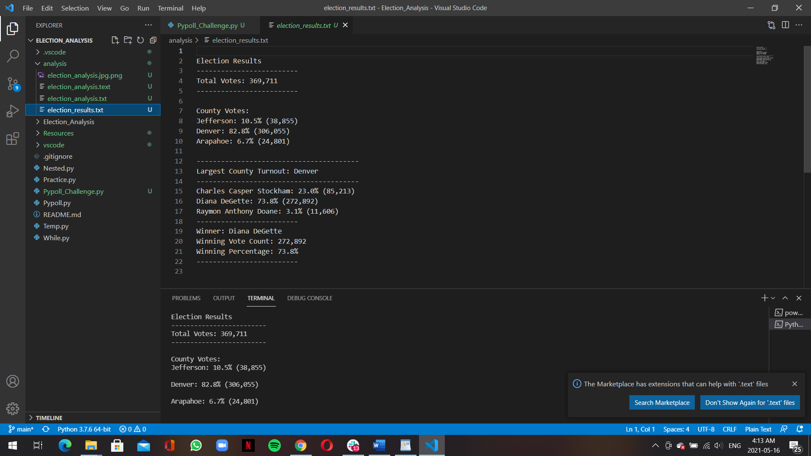

# Election_Analysis

## Election Audit 
You can view my work through this link https://github.com/Hisham9995/Election_Analysis

### Overview of Election Audit
This project was about an Election audit getting winning candidate's  As well as percentage and the numbers by
1- Calculate the total number of votes cast 
2- Putting a list of nominated candidate who recieved votes  
3- Calculating the total number of votes as well as percentage for each candidate
4- Determining  the winniner by the number of votes recieved  

### The Data
Contains columns , ballot ID, county, and candidate name.and ranges the full name and number of votes and percentage 

## Election Audit Results
The total amount of votes in the election  were 369,711. Jefferson won 10.5% of the total votes  in the second place  and Denver received the most votes within this election, winning 82.8% of the total votes. and  Arapahoe only won 6.7% of the total votes.

Regarding candidates  Diana DeGette had the most votes 73.8% she had   272,892 votes. The second place candidate Charles Casper Stockham  received 23% of the total votes. in the third place candidate, Raymon Anthony Doane  only received 3.1% of the overall votes. 

## Election Audit Summary
This script is so useful in determining the number of votes  on the other hand the winner and also the age of voters and each county or state voted for who and why
 it can give more details and data  If it is used at the right direction  and we can tell the top popular canidates in each county and why

  
